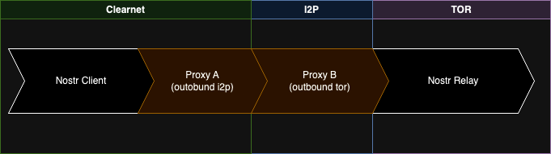

# Nostr Epoxy - Monetizable websocket proxies

## Project goals
Nostr Epoxy is a nostr-based, paid websocket proxy. It allows users to access relays and other websockets (for example cashu mints) that they would otherwise not be able to access. These can for example be relays on the tor/i2p or hyper networks, or it can be used to get around clearnet blockades. It incentivizes proxy operators to keep their infrastucture running by including in-band cashu payments #1.

Epoxy can act as a glue or translator between different networks making it seem (from the user's perspective) as being one single network. Part of this project is introducing the use of pubkeys (#2) to address services like epoxy, enabling secure communication through encryption. Addressing with pubkeys removes the use of network-specific addresses, increasing compatibitlity between networks. Pubkey addressing can simultaniously be used to eliminate reliance on DNS and SSL for secure communications.

The initial server-side implementation is a reverse proxy, because it's easy for relay operators to add this in front of or next to their existing relays. It allows them to experiment without impacting the majority of their trafic.
You can find the NIP-XX proposal [here.](NIP-XX.md)

### Why implement this in clients?

- Work around internet blockades
- Reach tor/i2p/hyper addresses without the need for running specialized software locally. (Connect to tor relays on iPhone clients)
- Prevent IP address exposure to destination relays, enhancing privacy.

### Why run a proxy?

- Stack sats, get compensated for the upkeep of infrastructure, which also acts as a spam-filter.
- Support user privacy.
- Help internet traffic cross network boundaries

## Roadmap
- [x] Announce proxy availability over Nostr
- [ ] Payments
  - [x] Require payment before proxying
  - [x] Use NIP-42 style messages to authorize by payment
  - [ ] [NIP-42](https://github.com/nostr-protocol/nips/pull/1609) extend with auth-by-payment proposal
- [ ] Privacy improvements
  - [ ] Add random delays (within a range) to mitigate timing-attacks.
- [ ] Pubkey addressing
  - [ ] Automated resolution of pubkey to address (domain/ip)
    - [x] Server side
    - [ ] Client side
  - [ ] [NIP-37 proposal](https://github.com/nostr-protocol/nips/pull/1585)
- [ ] Pubkey encryption (remove reliance on DNS + SSL)
  - [ ] Encrypt messages to pubkey of proxy (each hop)
  - [ ] Encrypt messages to pubkey of relay (destination)
  - [ ] Standardize handshake for switching to encryption (NIP-??)

## Proxy Flow

This flow describes the process of a customer connecting to a relay through a proxy. The example contains one proxy (one hop), but there is nothing restricting a customer from connecting through multiple of these proxies (multi-hop).


## Discovery

Find an overview of currently active proxies at [swissdash.site](https://swissdash.site)

Proxies must advertise their inbound addresses using a [NIP-37](https://github.com/ArjenStens/nips/blob/transport-method-announcement/37.md) kind `11111` transport method announcement:
```json
{
  "kind": 11111,
  "tags": [
    ["clearnet", "proxy.domain.com", "wss"],
    ["clearnet", "157.240.212.35", "ws"],
    ["tor", "somehash.onion", "ws"]
  ]
}
```

Proxies can publicly advertise their services by sending a `10377` proxy announcement once every minute, which also acts as a heartbeat to show that it's active.
```json
{
  "kind": 10377,
  "tags": [
    ["price", "3", "sat"],
    ["mint", "https://some.mint.com", "sat"],
    ["network-outbound", "clearnet"],
    ["network-outbound", "tor"],
    ["n", "clearnet"],
    ["url", "wss://proxy.domain.com", "clearnet"]
  ]
}
```

The message contains the following tags:
- `price` where the second index indicates the price per minute followed by the unit.
- `mint` where the second index indicates the mint's address, followed by the unit
- `n` to indicate on networks this proxy accepts inbound connections
- `network-outbound` to indicate which networks this proxy can reach. (In this example it can proxy to a tor relay), can occur multiple times
- `url` to indicate where this proxy accepts inbound connections. Should contain the same information as the kind `11111` event. This acts as a hint so that a client doesn't HAVE to do an explicit lookup of the `11111` event. (which might compromise privacy)

---

----

--- 
# Implementation - Nostr Epoxy Reverse Proxy

This implementation is a reverse-proxy that by default forwards all traffic to a predefined relay (set by the operator).
Only when a user sends a `PROXY` request will the proxy kick in and open a connection with the targeted websocket. When the user is authorized (using payment) it will step away from the connection and only close the connection once the purchased time has run out.

## How it works

- Relay operator sets DNS to route traffic to this reverse proxy
- Relay operator configures which relay this reverse proxy should forward to by default (their own relay instance)
- NERP by default forwards a websocket connection to the relay configured by the Relay operator.
- Customer can send ["PROXY", "wss://target.relay.com OR npubfTargetRelay"]
- NERP closes connection to default relay and reopens to the customer's target relay.

There is a short window in which the websocket between the customer and NERP is open, but the forwarded connection is not open yet. To resolve this, NERP buffers requests until tunnel is created and then replays these requests to the destination.

## Build & Run

Required NodeJS version `22`

### Run Local
```bash
pnpm install

pnpm run dev

# Available on http://localhost:8000
```

### Build Docker container
From the repository root directory, run:
```bash
docker build --tag nostr-epoxy-reverse-proxy .
```

## Docker Compose
Example with TOR proxy for outbound connections. Refer to the `.env.example` file to populate your `.env` file.

```yaml
services:
  nostr-nerp:
    container_name: "nostr-nerp"
    image: 'ghcr.io/arjenstens/nostr-epoxy-reverse-proxy'
    restart: always
    env_file:
      - your_env_file_here.env
  nostr-nerp-tor:
    container_name: "nostr-nerp-tor"
    image: 'dockage/tor-privoxy'
    restart: always
    volumes:
      - tor-config:/etc/tor
      - tor-data:/var/lib/tor
volumes:
  tor-config:
  tor-data:
```